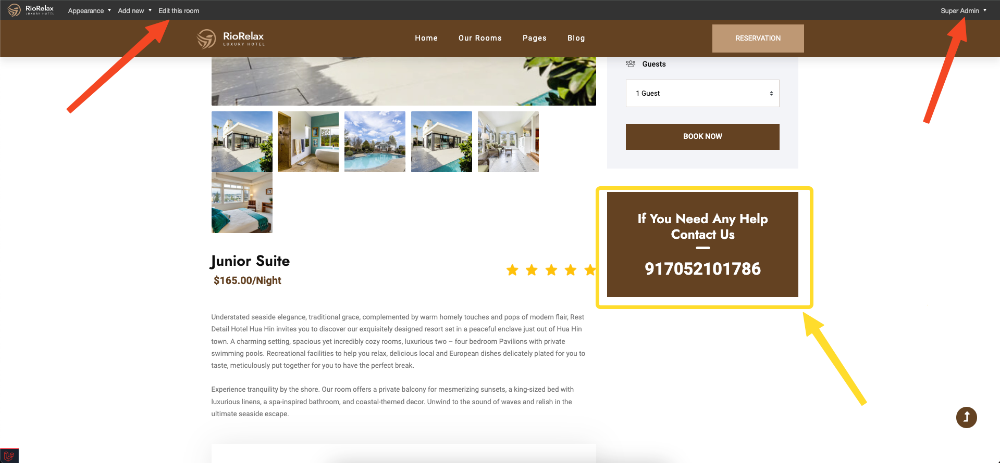
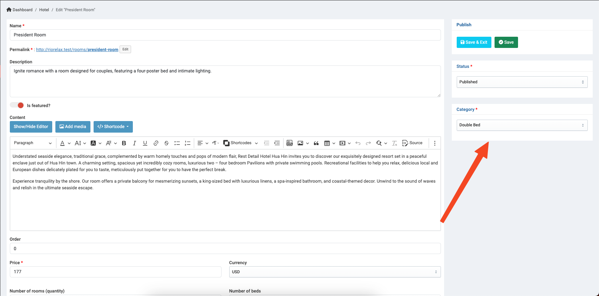

# Hotel booking

## Introduction

Welcome to the heart of your Hotel & Resort's digital experience—the **Hotel Booking feature**. From enhancing customer experience to revolutionizing reservation management, discover how this feature becomes the cornerstone of exceptional hospitality.

## Overview
In admin dashboard, you also can have an overall look this Hotel Booking features with (Rooms, Categories, Amenities, Services, Customers, Taxes and Settings)

## Rooms

The available rooms will appear depending on your customer's check-in date.

When you are logged into the admin account, the admin configuration bar will appear, guiding you to swiftly navigate to the 'Edit Room' admin page, allowing you to set up your room efficiently.(You can also click on the 'EDIT' button for each room in the admin panel.)

These hotel rules and cancellation policies can also be configured in the Theme Options within the admin settings.

Let's set up your room in the admin panel, and this action will alter the frontend theme.

The Order box allows you to manage the priority of room listings on your website. (The higher the index, the higher the priority)

Let check the Room Availability section, You can manage the price, status, and number of rooms available for online booking for this room type, depending on the date.

Don't forget to set the category for the room, adjust the status (only published items will be visible to your customers), and save the changes.

## Categories
**This session help you to create new category tag for your rooms.**

Rooms with the same category will appear in the 'Related Rooms' section. The higher the order index, the higher the priority for display.

## Amenities
**This session help you to create new amenity tag for your rooms.**

## Services
**This session help you to create new service for your Business.**

These services will be used in the Services listing and the Service detail page.

## Customers, Taxes, Setting
**This section helps you manage your customers' accounts, configure taxes (VAT, etc.) based on your country, and set up the currency.**

## Bookings Management:
**We provide powerful tools to assist you in managing all bookings with ease.**

Furthermore, you can also have a comprehensive view of all bookings based on the calendar through the Booking Report.
