# Theme Options

## Setup theme options

On Admin Bar -> Appearance -> Theme options.

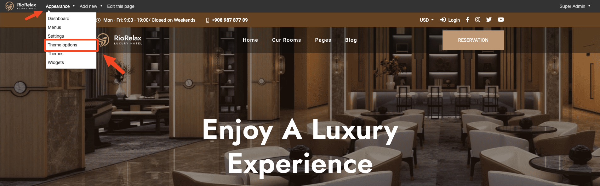

Or go to Admin -> Appearance -> Theme options.

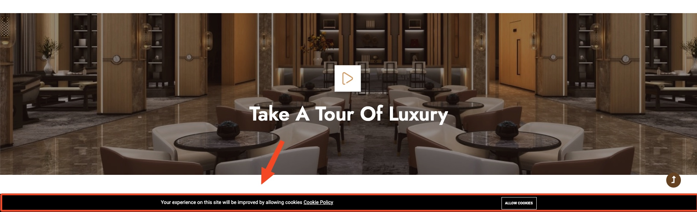

## Header

Customize header

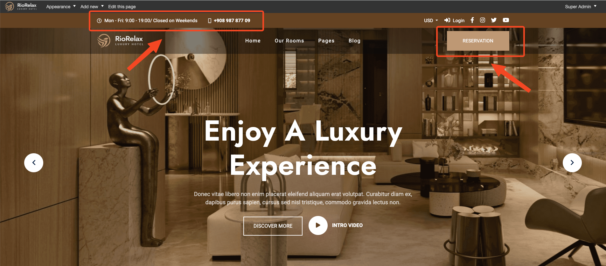

Edit **Hotline, Email**. Go to Admin -> Appearance -> Theme options -> Contact tab.

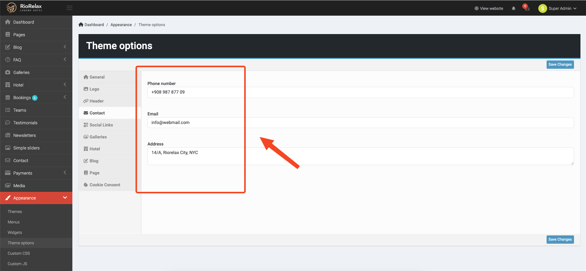

Edit **Enabled Header Top, Button Header**. Go to Admin -> Appearance -> Theme options -> Header tab.

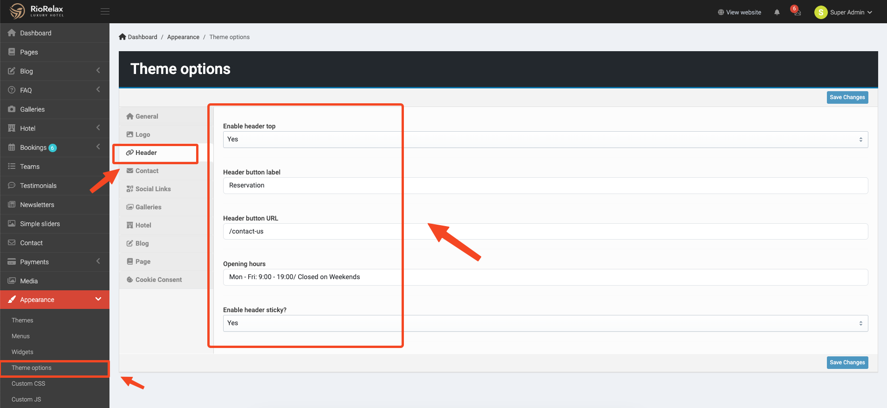

Edit **Logo** and **Favicon**. Go to Admin -> Appearance -> Theme options -> Logo tab.

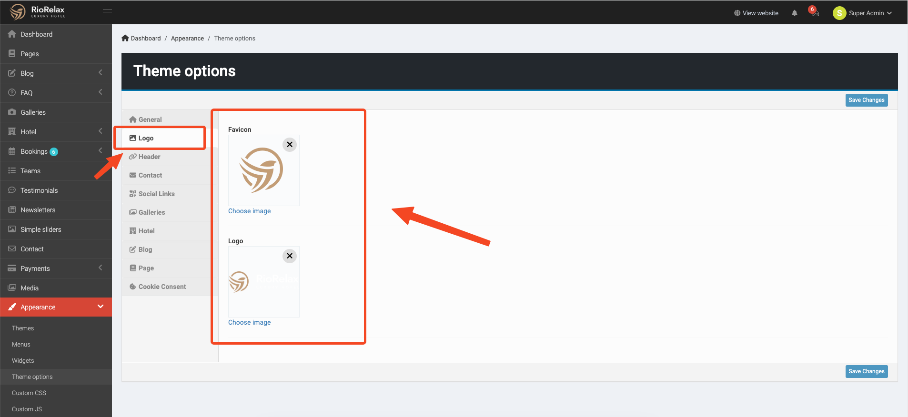

## Footer

Edit copyright text

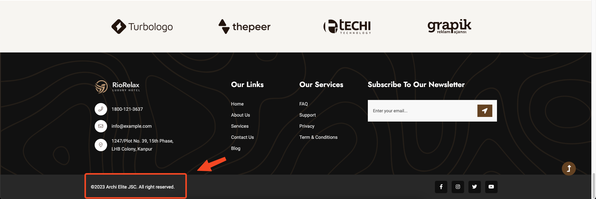

Go to Admin -> Appearance -> Theme options -> General tab

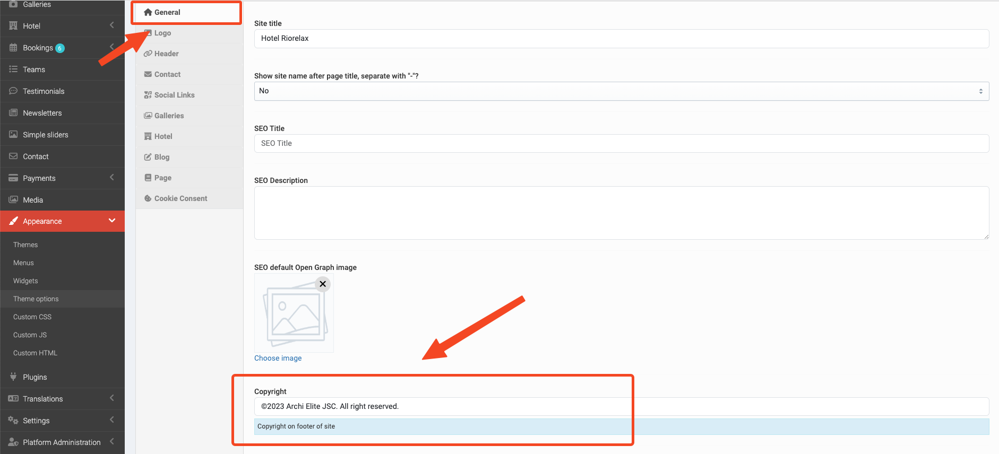

Edit social links, go to Admin -> Appearance -> Theme options -> Social links tab

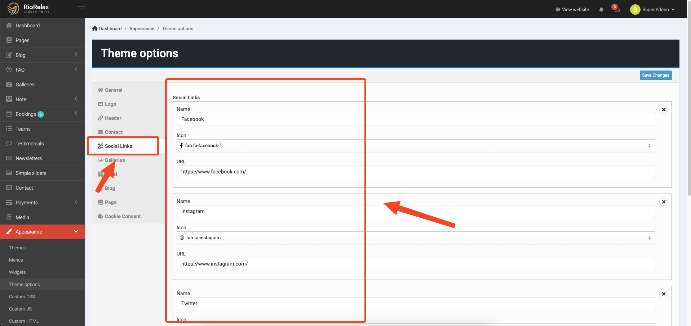

## Others

Edit **Cookie consent**"

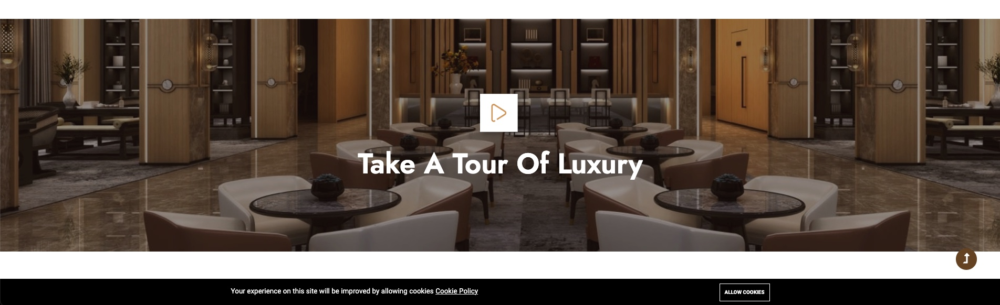

Go to Admin -> Appearance -> Theme options -> Cookie consent tab

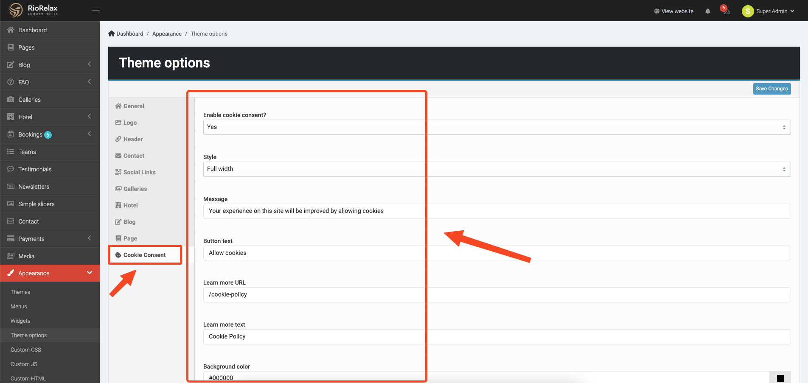