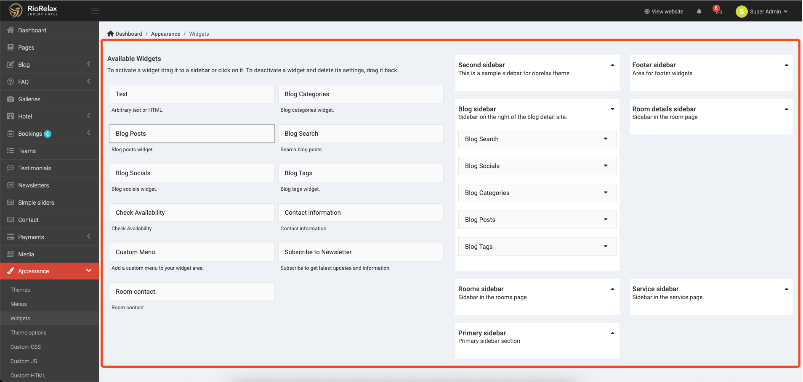
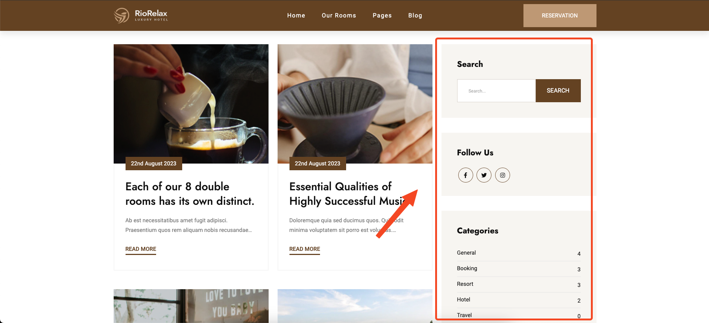
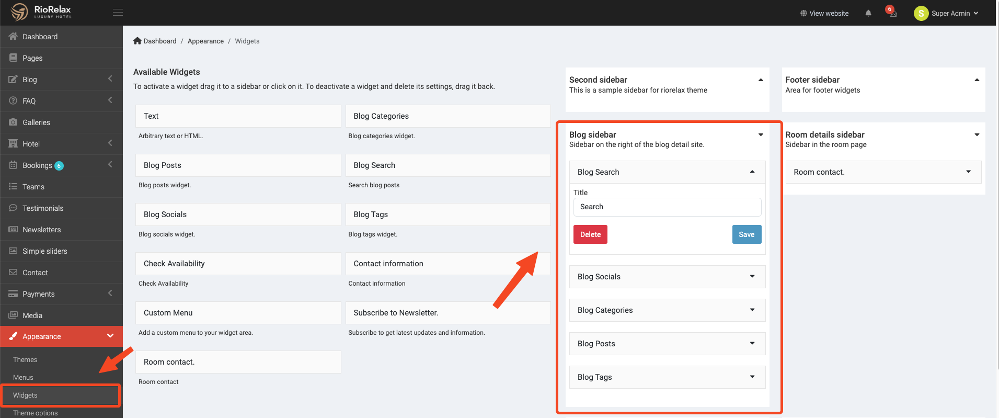
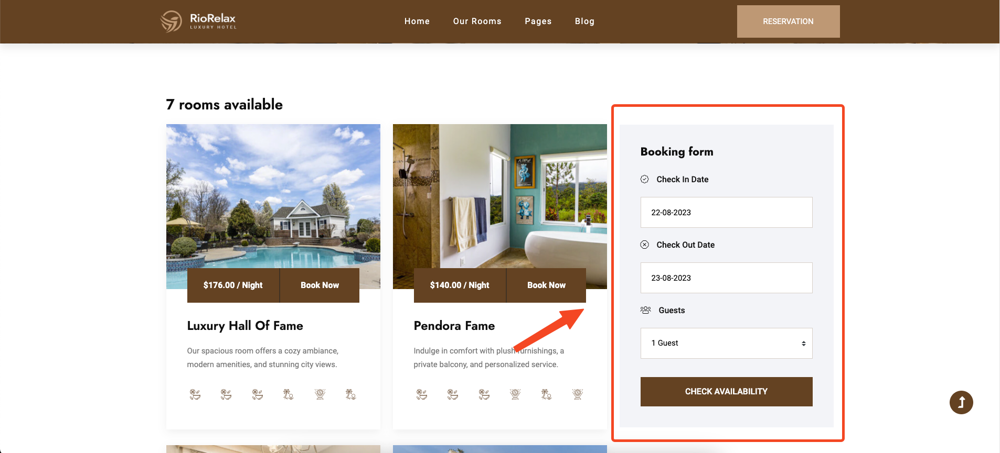
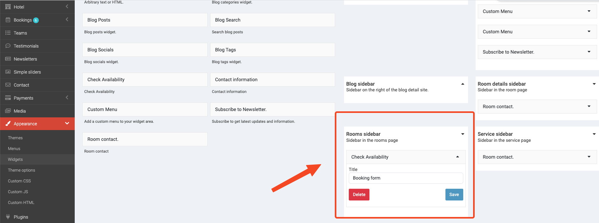
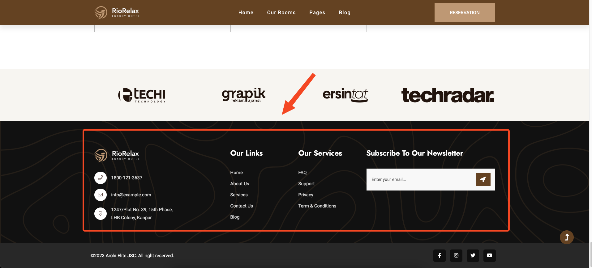
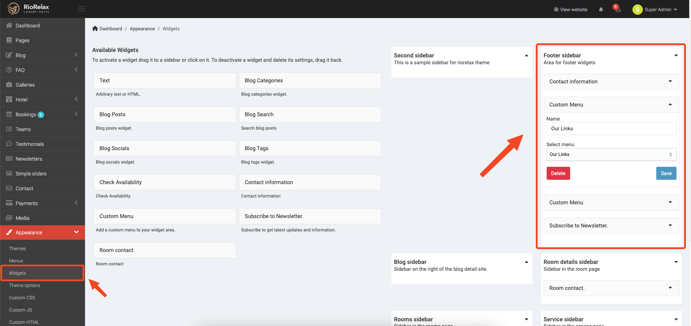
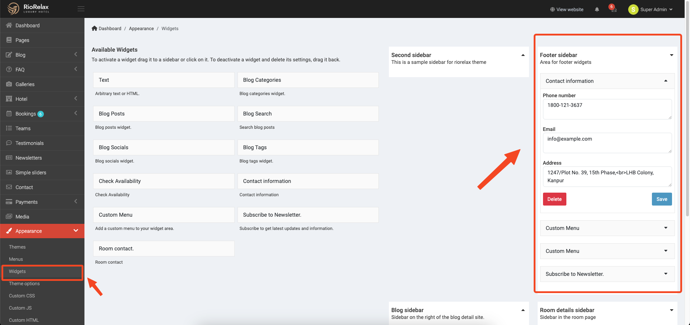

# Usage Widgets

You can customize widgets in `Admin` -> `Appearance` -> `Widgets`.

## Blog Sidebar

In the sidebar page blog, you can see a blog search, blog categories and more widgets.

You can also modify it in **Blog Search**.

Same for other Widgets

## Rooms Sidebar

In the sidebar page rooms, you can see a Check Availability Form widget.

You can also modify it in **Check Availability Form**.

## Footer
In the footer, you can see a contact information, and footer menu.

You can also modify it in **Footer menu**.

Second, below the Popular items is the Contact information

